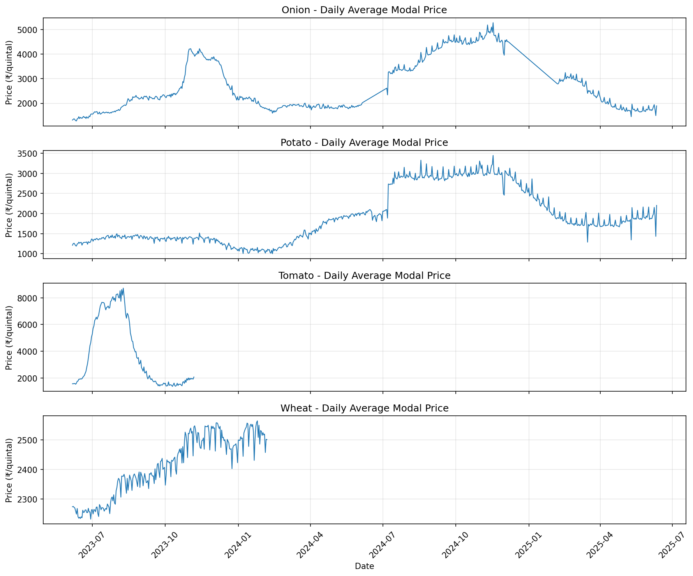
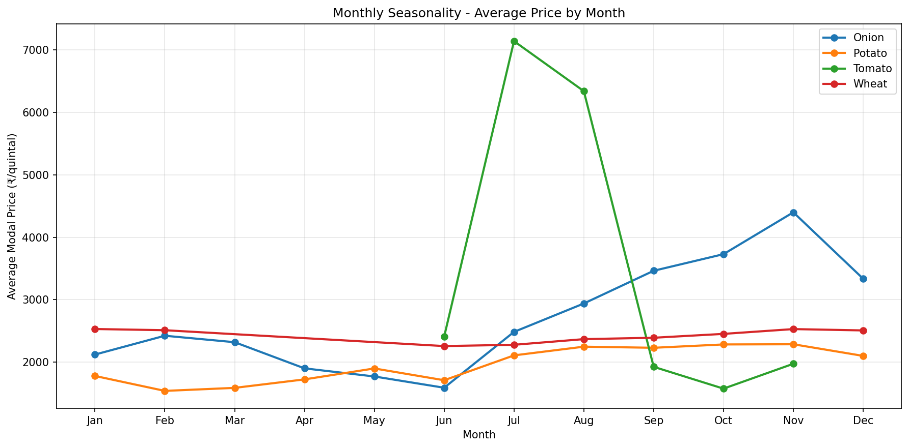
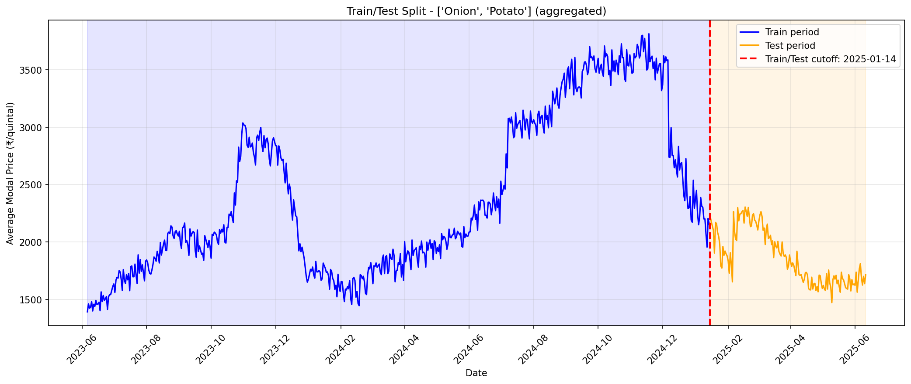
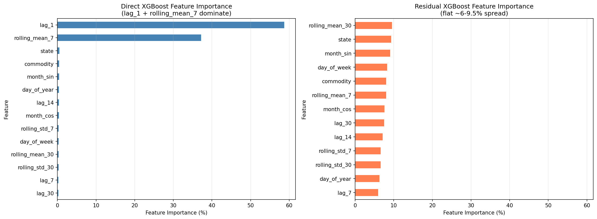
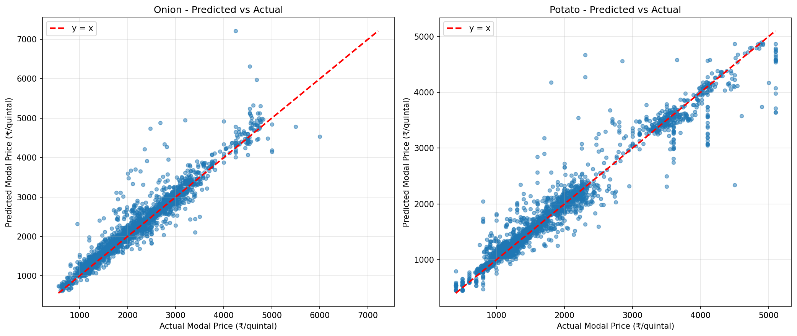

# agri-price-forecaster

A machine learning pipeline to forecast agricultural commodity prices across Indian *mandi* (market) locations. It ingests historical mandi price data, cleans and deduplicates it, engineers time-series features, and benchmarks forecasting models against a strong naive baseline.

> **Status — v1 COMPLETE through the MODELING stage.**
> What's done: data pipeline (clean → features) + feature engineering + a three-way model evaluation (**naive lag-1 baseline vs. direct XGBoost vs. residual-target XGBoost**), fully verified and documented.
> What's **not** done (deliberately scoped as future work): **deployment** — a FastAPI serving layer and Docker containerization are planned for Phase 2, deferred until those tools are studied directly rather than agent-generated without understanding. No serving/API code exists in this repo yet.

## Problem Statement

Agricultural commodity prices in Indian mandis fluctuate significantly based on season, location, and market dynamics. This project builds a price-prediction pipeline that ingests historical mandi price data, cleans and engineers features from it, trains and rigorously evaluates forecasting models, and reports an honest comparison against a naive baseline. (Exposing predictions via an API is a planned later phase — see [Roadmap](#roadmap--next-phases).)

## TL;DR — What v1 Found

At daily state+commodity granularity, mandi modal prices behave close to a **random walk**: the best predictor of tomorrow's price is today's price. Two XGBoost variants were trained to try to beat a naive lag-1 baseline:

- **Direct XGBoost** beats the baseline on **RMSE only** (+7.7% overall — it shrinks the largest errors) but **loses on MAE (−11.9%) and MAPE (−13.6%)** — it adds noise to typical small day-to-day moves.
- **Residual XGBoost** (the targeted attempt to fix the MAE/MAPE weakness by predicting the price *change* instead of the level) **loses on all three metrics** (MAE −12.2%, RMSE −3.8%, MAPE −10.0%). Its feature importance is strikingly flat (all 13 features between 5.9%–9.5% gain), which is itself the evidence: price *changes* are near-unpredictable from price-history features alone.

**This is a real, evidenced finding, not a failed experiment.** The pipeline correctly verifies its scope, prevents leakage, evaluates apples-to-apples, and reports an honest null result against a strong baseline. The clear next step is structural supply-side features (arrivals, weather, policy) — see the [Roadmap](#roadmap--next-phases).

## Project Structure

```
agri-price-forecaster/
├─ data/
│  ├─ raw/
│  │  └─ extracted/                  # Raw Kaggle CSV (Agriculture_price_dataset.csv)
│  └─ processed/
│     ├─ mandi_prices_cleaned.csv    # Output of cleaning pipeline
│     ├─ mandi_prices_features.csv   # Output of feature engineering
│     └─ baseline_predictions.csv    # Naive lag-1 baseline predictions
├─ src/
│  ├─ data/
│  │  └─ clean.py                    # Data cleaning + state-name deduplication
│  ├─ features/
│  │  ├─ check_granularity.py        # Granularity analysis (market vs. state level)
│  │  ├─ build_features.py           # Feature engineering
│  │  └─ verify_features_csv.py      # Feature-output integrity checks
│  ├─ models/
│  │  ├─ train_baseline.py           # Naive lag-1 baseline
│  │  ├─ investigate_gaps.py         # Commodity coverage-gap analysis
│  │  ├─ pre_training_verification.py # Pre-training integrity checks (+ shared load/split)
│  │  ├─ seasonal_check.py           # Train/test seasonality analysis
│  │  ├─ train_xgboost.py            # Direct XGBoost training + baseline comparison
│  │  └─ train_xgboost_residual.py   # Residual-target XGBoost + 3-way comparison
│  └─ config.py                      # Centralized paths and column-name constants
├─ models_store/                     # Saved model artifacts (.json) + run logs
├─ visualizations/
│  ├─ generate_plots.py              # Script to generate all project plots
│  ├─ price_trends.png               # Daily average price trends per commodity
│  ├─ monthly_seasonality.png        # Monthly seasonality patterns
│  ├─ train_test_split.png           # Train/test split visualization
│  ├─ predicted_vs_actual.png        # Predicted vs actual scatter plots
│  └─ feature_importance.png          # Feature importance comparison (direct vs residual)
├─ notebooks/                        # (placeholder — exploratory analysis, TBD)
├─ tests/                            # (placeholder — TBD)
├─ requirements.txt
└─ .gitignore
```

> Note: there is intentionally **no `src/api/` directory** yet. Serving/deployment is Phase 2.

## Data & Modeling Scope

**Original dataset** (`data/raw/extracted/Agriculture_price_dataset.csv`): **737,392 rows**, 5 commodities, 2023-06-06 → 2025-06-11:

| Commodity | Rows | Share |
|---|---:|---:|
| Potato | 327,332 | 44.4% |
| Onion | 298,658 | 40.5% |
| Wheat | 76,976 | 10.4% |
| Tomato | 26,644 | 3.6% |
| Rice | 7,782 | 1.1% |

**Rice dropped early** during cleaning (~1% of data, insufficient volume for state+commodity coverage).

**Cleaning pipeline** (`src/data/clean.py`):
- Column-name standardization (lowercase + underscores)
- Date parsing with error coercion → `price_date`
- Price validation: `min_price ≤ modal_price ≤ max_price`, all prices > 0
- Per-commodity IQR outlier removal on `modal_price` (upper bound Q3 + 3×IQR)
- **State-name deduplication** (added after pre-training verification surfaced duplicate state labels): 30 raw state variants → 26 canonical states/UTs. Merges: `' Punjab'→'Punjab'`, `'Chattisgarh'→'Chhattisgarh'`, `'Jammu and Kashmir'→'Jammu & Kashmir'`, `'Tamilnadu'→'Tamil Nadu'`, `'Gao'→'Goa'`, `'Uttrakhand'→'Uttarakhand'`.
- Output: `data/processed/mandi_prices_cleaned.csv` (**722,909 rows × 8 columns**)

**Feature granularity: state + commodity, not market.** Empirical coverage analysis (`src/features/check_granularity.py`) showed market-level grouping is too sparse for time-series features — a `lag_7` at market level would span weeks of calendar time, not days:

| Granularity | Median distinct dates | Coverage of 736-day span | Groups |
|---|---|---|---|
| market_name + commodity | 125 | **17.0%** | 3,392 |
| state + commodity | 316 | **42.9%** | 98 |

State+commodity was chosen as the modeling granularity.

**Tomato and Wheat excluded from the v1 MODELING scope (not the cleaning/feature scope).** A hard national reporting cutoff was discovered in the source data: Tomato stops at **2023-11-06**, Wheat at **2024-02-06**. This was confirmed as a genuine source-data seasonal-tracking gap, not a pipeline bug, via (a) raw-vs-cleaned comparison showing identical cutoffs and (b) state-count analysis showing a simultaneous national drop rather than a gradual coverage decline. Both commodities fall entirely inside the training window and have zero test-period rows, making them unusable for a time-based train/test split. They remain cleaned and feature-engineered for future use.

**v1 modeling scope: Onion + Potato only** (`COMMODITIES_MODELING_V1` in `src/config.py`). After scope filter + state+commodity aggregation: **32,870 rows × 17 columns** in `data/processed/mandi_prices_features.csv`.





## Feature Engineering

Final model input: **14 features** (`MODEL_FEATURES` in `src/models/pre_training_verification.py`, shared by import with both training scripts).

| Group | Features | Notes |
|---|---|---|
| Lag | `lag_1`, `lag_7`, `lag_14`, `lag_30` | Lags by **report count** within each (state, commodity) group, not calendar days (reporting is irregular). |
| Rolling | `rolling_mean_7`, `rolling_std_7`, `rolling_mean_30`, `rolling_std_30` | Window over prior reporting rows. |
| Calendar | `month_sin`, `month_cos`, `day_of_week`, `day_of_year` | Cyclic month encoding (sin/cos) avoids a false Jan→Dec jump. |
| Categorical | `commodity`, `state` | Cast to pandas `category` dtype; passed to XGBoost with `enable_categorical=True`. Train and test share the exact same category set. |

**Leakage prevention:** every rolling statistic is computed on a `.shift(1)`'d series within group, so a row's own `modal_price` is never included in its own rolling mean/std. Lags are by definition prior rows. The target `modal_price` is verified absent from the feature list (pre-training check F3).

**NaN handling — explicit decision:** no imputation. Lag/rolling NaNs occur at the start of each (state, commodity) group (too few prior reporting rows) and are structurally informative. XGBoost learns a default split direction for missing values natively, preserving the "not-enough-history" signal rather than fabricating values.

**`price_vs_msp` deliberately excluded.** It is computed only for Wheat (the only MSP-covered crop) in `build_features.py`, so it is 100% NaN in the Onion+Potato scope. Including it would add a uniformly-missing column with zero signal.

## Modeling Results

Time-based 80/20 split, cutoff **2025-01-14** (train ≤ cutoff, test > cutoff). Train: **22,277 rows** (2023-06-06 → 2025-01-14). Test: **5,599 rows** (2025-01-15 → 2025-06-11). No overlap, no leakage.



**Three models, identical setup:**
- **Naive lag-1 baseline** — `predicted = lag_1`.
- **Direct XGBoost** — predicts `modal_price` directly. `n_estimators=300, max_depth=6, learning_rate=0.05`, `objective=reg:squarederror`, `enable_categorical=True`, `tree_method=hist`, `random_state=42`. Native NaN handling, no imputation.
- **Residual XGBoost** — predicts the **residual** (`modal_price − lag_1`, i.e. the price *change*), then reconstructs the price at inference as `predicted_price = lag_1 + predicted_residual`. Same hyperparameters; `lag_1` is excluded from its feature set (it is already baked into the target). Motivation: force the model to learn what the naive baseline gets *wrong* rather than relearning the price level.

All three are scored on the **same 5,598-row post-cutoff test subset** (rows with non-NaN `lag_1`, required to construct the residual target). The direct model's standalone run on the full 5,599-row test set gave 122.20 / 225.92 / 6.93 — cross-checked and consistent with its subset numbers below.

| Group | n | Model | MAE | RMSE | MAPE % |
|---|---:|---|---:|---:|---:|
| OVERALL | 5,598 | naive lag-1 (baseline) | 109.16 | 244.76 | 6.10 |
| | | direct XGBoost | 122.10 (−11.9%) | **225.77 (+7.7%)** | 6.93 (−13.6%) |
| | | residual XGBoost | 122.45 (−12.2%) | 254.05 (−3.8%) | 6.71 (−10.0%) |
| Onion | 2,499 | naive lag-1 (baseline) | 110.48 | 251.04 | 5.69 |
| | | direct XGBoost | 137.45 (−24.4%) | **243.31 (+3.1%)** | 7.00 (−23.0%) |
| | | residual XGBoost | 129.35 (−17.1%) | 265.37 (−5.7%) | 6.50 (−14.2%) |
| Potato | 3,099 | naive lag-1 (baseline) | 108.09 | 239.57 | 6.44 |
| | | direct XGBoost | 109.72 (−1.5%) | **210.57 (+12.1%)** | 6.87 (−6.7%) |
| | | residual XGBoost | 116.88 (−8.1%) | 244.53 (−2.1%) | 6.88 (−6.8%) |

Δ% in parentheses is vs the naive baseline within the same group; **positive = model better** (all metrics are lower-is-better). Bolded cells are the only ones where a model beats the baseline.

### Honest headline

- **The direct XGBoost beats the naive lag-1 baseline on RMSE only, and loses on MAE and MAPE.** Overall RMSE improves 244.76 → 225.77 (7.7% better — it meaningfully shrinks the *largest* errors), while overall MAE worsens 109.16 → 122.10 (11.9% worse) and MAPE worsens 6.10% → 6.93% (13.6% worse). It adds noise to typical small moves.
- **The residual XGBoost — the targeted fix for that MAE/MAPE weakness — loses on all three metrics.** Reformulating the target to the price *change* did not help; it traded the RMSE win away without recovering MAE/MAPE.
- The pattern holds per-commodity: Onion is hardest (most volatile), Potato is closest to baseline.

**Feature importance — direct XGBoost (gain):**

| Rank | Feature | gain % |
|---|---|---:|
| 1 | `lag_1` | **58.72** |
| 2 | `rolling_mean_7` | **37.18** |
| 3 | `state` | 0.49 |
| 4 | `commodity` | 0.45 |
| 5 | `month_sin` | 0.42 |
| 6 | `day_of_year` | 0.35 |
| 7 | `month_cos` | 0.34 |
| 8 | `lag_14` | 0.34 |
| 9–14 | `rolling_std_7`, `rolling_mean_30`, `day_of_week`, `rolling_std_30`, `lag_7`, `lag_30` | 0.25–0.32 |

`lag_1` + `rolling_mean_7` together account for **~96% of total gain**. Every calendar feature, both categorical features, and all longer lags contribute <1% combined. The direct model is essentially re-learning the price level.

**Feature importance — residual XGBoost (gain; `lag_1` excluded by design):**

| Rank | Feature | gain % |
|---|---|---:|
| 1 | `rolling_mean_30` | 9.53 |
| 2 | `state` | 9.33 |
| 3 | `month_sin` | 9.10 |
| 4 | `day_of_week` | 8.31 |
| 5 | `commodity` | 8.03 |
| 6 | `rolling_mean_7` | 8.01 |
| 7 | `month_cos` | 7.59 |
| 8 | `lag_30` | 7.53 |
| 9 | `lag_14` | 7.10 |
| 10–13 | `rolling_std_7`, `rolling_std_30`, `day_of_year`, `lag_7` | 5.93–6.63 |

This is the most diagnostic table in the project: with the price level removed, **no single feature dominates — all 13 features cluster between 5.9% and 9.5% gain.** That uniformity means the model has nothing better than near-random weighting to fall back on when predicting price *changes*. Calendar and identity features, which carried negligible weight for the level, rise to the top here only by default — not because they carry strong change-predictive signal.





### Interpretation

At daily state-level granularity, mandi modal prices behave close to a random walk: the best predictor of tomorrow's price is today's price (`lag_1`), and a 7-period rolling mean is the only feature that adds meaningful signal on top. Calendar effects and state/commodity identity carry negligible predictive weight once recent price is known. Beating a naive lag baseline here is genuinely difficult without **structural features** — arrival volume, weather, and policy shocks — that are not present in this dataset. The direct model's RMSE improvement shows it extracts *some* signal (it reduces the largest errors), but not enough to overcome the noise it adds on typical small day-to-day moves; the residual experiment confirms that weakness cannot be closed by target reformulation alone.

## Setup

```bash
python -m venv venv
# Windows
venv\Scripts\activate
# Unix/macOS
source venv/bin/activate

pip install -r requirements.txt
```

## Running the Pipeline

```bash
# Phase 1 — clean raw data (includes state-name deduplication)
python -m src.data.clean

# Phase 2 — check granularity (optional diagnostic)
python -m src.features.check_granularity

# Phase 2 — build features
python -m src.features.build_features

# Phase 3 — pre-training integrity verification (no model trained)
python -m src.models.pre_training_verification

# Phase 3 — train/test seasonality analysis
python -m src.models.seasonal_check

# Phase 3 — naive lag-1 baseline
python -m src.models.train_baseline

# Phase 3 — train direct XGBoost, score vs baseline, save model + log run
python -m src.models.train_xgboost

# Phase 3 — train residual XGBoost, score + 3-way comparison (baseline/direct/residual)
python -m src.models.train_xgboost_residual
```

## Known Limitations

- **State-level, not mandi-level.** v1 forecasts state+commodity daily averages, not individual-mandi recommendations. This is a data-density limitation: market-level coverage is ~17% of the date span (too sparse for lag features), documented in the granularity analysis above.
- **v1 scope is Onion + Potato only.** Tomato and Wheat have a hard national reporting cutoff in the source data (Nov 2023 / Feb 2024) and need a supplementary or updated data source to become forecastable. They remain cleaned and feature-engineered for when such data is available.
- **No structural demand/supply features.** Arrivals (market arrival volume), weather, MSP (where in scope), and policy events are not currently included. Both model runs show the price-history-only signal is near-saturated by `lag_1` + `rolling_mean_7` (direct) or uniformly weak (residual), so structural supply-side features are the most promising direction for future improvement — see Phase 3 below.

## Column Name Reference

All column names are defined in `src/config.py` — never hardcoded in scripts.

| Constant | Value |
|---|---|
| `COL_DATE` | `price_date` |
| `COL_STATE` | `state` |
| `COL_DISTRICT` | `district_name` |
| `COL_MARKET` | `market_name` |
| `COL_COMMODITY` | `commodity` |
| `COL_MODAL_PRICE` | `modal_price` |

## Stack

**Actually used by the v1 pipeline:**
- Data: `pandas`, `numpy`
- Models: `xgboost`
- Experiment tracking: `mlflow` (each training run attempts MLflow logging with a portable JSON run-log fallback in `models_store/`)

**Listed in `requirements.txt` but not yet used** (kept for planned phases): `scikit-learn`, `lightgbm` (candidate models for v2), `fastapi` + `uvicorn` (Phase 2 deployment), `pytest` (test harness, TBD).

## Roadmap / Next Phases

- **Phase 2 — Deployment (deferred).** FastAPI serving layer + Docker containerization. This is deliberately *not* generated yet: it will be built only after studying FastAPI/Docker directly, so the serving layer is understood rather than produced without comprehension. No `src/api/` code exists today.
- **Phase 3 — Structural data.** Incorporate Agmarknet arrivals + price data (available from Nov 2025 onward) to test whether structural supply-side features (arrival volume, and eventually weather/policy) can close the gap to the naive baseline that price-history-only features could not. This is the direct, evidence-based response to v1's null result.
- **Phase 4 — Portfolio.** This project is the forecasting piece of a larger agriculture portfolio; the remaining planned pieces are: a **CNN** for image-based quality/ripeness grading, a **RAG** system for policy/MSP document Q&A, and an **agentic layer** (LangGraph) orchestrating across the forecasting model, the CNN, and the RAG system.

## How This Was Built

This project was built **iteratively with an AI coding agent under close supervision** — not generated end-to-end and accepted on faith. Every pipeline stage was independently verified: row counts at each transformation, leakage checks (target absent from features, rolling stats computed on shifted series), a time-based train/test split checked for overlap and seasonality balance, and manual spot-checks of the data. Multiple genuine bugs were caught and fixed along the way — silent date-parsing errors, config/column-name mismatches, and duplicate state labels that pre-training verification surfaced before any model was trained. Stating this plainly is more honest, and a stronger signal of a trustworthy pipeline, than presenting the work as effortless or hand-written.

---
*v1 status: modeling complete and verified. Deployment is planned future work.*
